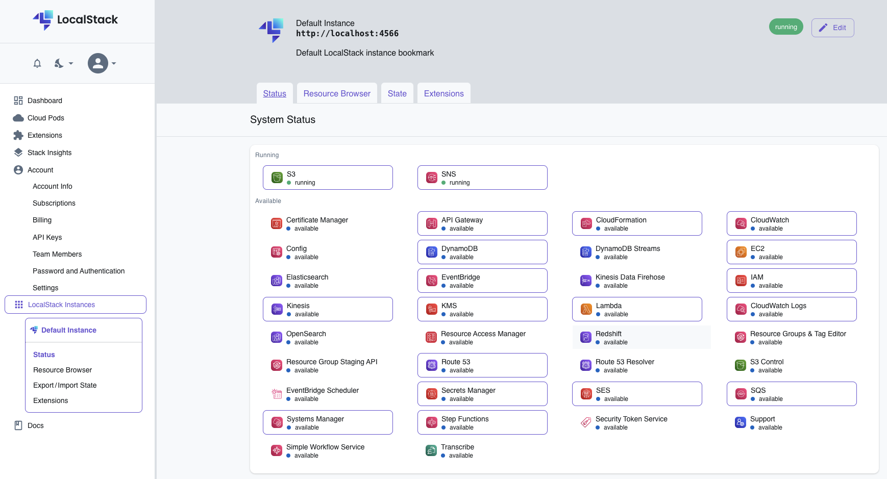

# Localstack
This is a simple guide for working with AWS (S3) on our laptop 
by installing [localstack](https://github.com/localstack/localstack).

___

First of all, we need [Python](https://www.python.org/), check our python version:
```shell
python3 --version
```
If we don't have it, we can install by the following links:
- [Mac](https://www.python.org/downloads/macos/)
- [Ubuntu](https://www.digitalocean.com/community/tutorials/how-to-install-python-3-and-set-up-a-programming-environment-on-an-ubuntu-22-04-server)

___

Now, we can install [localstack](https://docs.localstack.cloud/getting-started/installation/):
```shell
brew install localstack/tap/localstack-cli
```
Check the version:
```shell
localstack --version
```
Then run it:
```shell
localstack start
```

___

For the web interface:
1. Go to [web interface](https://app.localstack.cloud/inst/default/status)
2. Change the endpoint to http://localhost:4566.
3. Now we can use every service that we want. We can enable everyone by clicking!

<p align="center"></p>

___

For dealing with [localstack](https://github.com/localstack/localstack) by command line, 
we can install [awscli-local](https://github.com/localstack/awscli-local):
```shell
pip3 install awscli-local
```

Now, we can deal with s3 in command line :)
- create a bucket on s3:
    ```shell
    awslocal s3api create-bucket --bucket document
    ```
  We can add `--region eu-west-1` to use a certain region.
- upload a file to s3:
    ```shell
    awslocal s3 cp ~/Desktop/test.xlsx s3://document/text_3.xlsx
    ```
- check the s3 objects:
    ```shell
    awslocal s3api list-objects --bucket document --output text
    ```
- download a file from s3:
    ```shell
    awslocal s3api get-object --bucket document --key test.xlsx ~/Desktop/test.xlsx --debug
    ```
